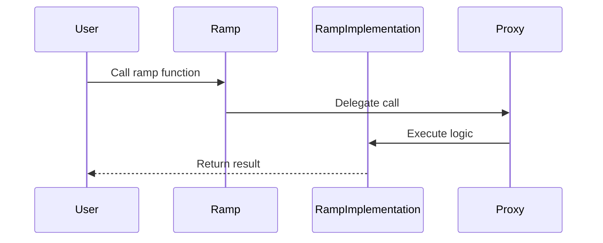
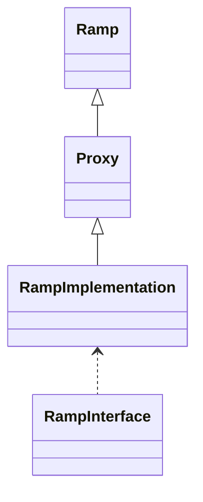

# Aetherlink Contracts Module Documentation

This directory contains detailed technical documentation for the major modules of the Aetherlink EVM Contracts project.

## Project Overview

Aetherlink Contracts are used for EVM chain oracle to receive cross-chain Ethereum contracts.

## Available Module Documentation

* **RampImplementation** - Core contract for cross-chain ramp logic
* **Proxy** - Upgradeable proxy contract for delegating calls
* **Ramp** - Entry point contract for ramp operations
* **MockContracts/MockRouter** - Mock contract for testing router logic
* **interfaces/** - Solidity interfaces for Ramp and Router
* **scripts/** - Automation scripts for deployment, verification, and utility tasks
* **test/** - JavaScript test cases for contract validation

## Documentation Format

Each module documentation includes:

1. **Data Flow Sequence Diagram** - Illustrates the typical flow of data and interactions between components
2. **Relationship Diagram** - Shows the contract relationships and dependencies within the module
3. **Module Explanation** - Detailed overview of the module's purpose, components, and capabilities

---

## Module: RampImplementation

### Data Flow Sequence Diagram

### Relationship Diagram

### Module Explanation
RampImplementation is the core contract handling cross-chain ramp logic, including validation, state updates, and event emission.

---

## Module: Proxy

### Module Explanation
Proxy is an upgradeable contract that delegates calls to RampImplementation, enabling contract upgrades without changing the address.

---

## Module: Ramp

### Module Explanation
Ramp is the entry point for users, forwarding calls to the Proxy contract.

---

## Module: MockContracts/MockRouter

### Module Explanation
MockRouter is used for testing and simulating router logic in a controlled environment.

---

## Module: interfaces/

### Module Explanation
Contains Solidity interfaces (RampInterface, RouterInterface) for contract abstraction and interaction.

---

## Module: scripts/

### Module Explanation
Automation scripts for deployment, verification, and contract management.

---

## Module: test/

### Module Explanation
JavaScript test cases for validating contract logic and integration.

---

_This file is maintained automatically as part of the development workflow._ 