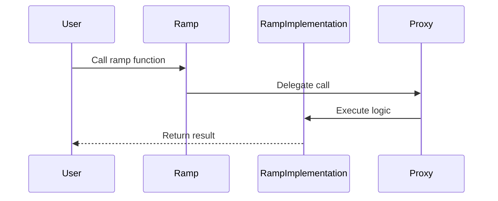
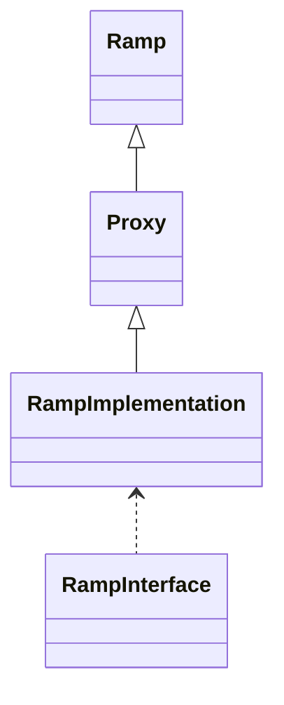

# Aetherlink EVM Oracle Cross-Chain Contracts: Overview & Structure

## Overview

Aetherlink is an advanced EVM-compatible oracle cross-chain contract suite, designed to securely relay, validate, and synchronize data and value between Ethereum and Aelf blockchains. It enables:

- **Cross-chain messaging and asset transfer**: Securely receive, verify, and process cross-chain requests and responses.
- **Modular upgradability**: Proxy pattern allows seamless contract upgrades without changing user-facing addresses.
- **Oracle integration**: Designed for decentralized oracle networks to deliver off-chain data and cross-chain state proofs.
- **Robust testing and automation**: Comprehensive test suite and deployment scripts ensure reliability and maintainability.
- **Security and extensibility**: Interface-driven design, mock contracts for simulation, and strict separation of core, proxy, and interface logic.

## Root Directory (Actual Structure)

```
/
├── .git/                # Git repository data
├── .github/             # GitHub workflows and configuration
├── artifacts/           # Compiled contract artifacts
├── cache/               # Build cache
├── contracts/           # Solidity smart contracts
│   ├── Proxy.sol
│   ├── Ramp.sol
│   ├── RampImplementation.sol
│   ├── MockContracts/
│   │   └── MockRouter.sol
│   └── interfaces/
│       ├── RampInterface.sol
│       └── RouterInterface.sol
├── contracts-dbg/       # Debugging artifacts
├── coverage/            # Coverage reports
├── docs/                # Project documentation
│   ├── project_tracker.md
│   ├── MODULE_DOCUMENTATION.md
│   ├── DIRECTORY_STRUCTURE.md
├── node_modules/        # Node.js dependencies
├── scripts/             # Automation and utility scripts
│   ├── transmit-test.js
│   ├── validate-signature.js
│   ├── deploy-proxy.js
│   ├── get-type-hash-and-domain-separator.js
│   ├── send-request.js
│   ├── set-type-hash-and-domain-separator.js
│   ├── set-whitelist-chainid.js
│   ├── add-sender.js
│   ├── check-sender.js
│   ├── decode.js
│   ├── verify.js
│   ├── update-proxy.js
│   └── updateOracleNodes.js
├── test/                # JavaScript test cases
│   ├── Ramp.test.js
│   └── RampDeploy.test.js
├── .gitignore           # Git ignore configuration
├── .solcover.js         # Solidity coverage config
├── azure-pipelines.yml  # Azure CI/CD pipeline config
├── dbg.project.json     # Debug project config
├── foundry.toml         # Foundry configuration
├── hardhat.config.js    # Hardhat configuration
├── package.json         # Node.js project manifest
├── package-lock.json    # Node.js lockfile
├── LICENSE              # License information
├── README.md            # Project documentation
```

---

# Module Documentation

## Available Modules

* **RampImplementation** - Core contract for cross-chain ramp logic
* **Proxy** - Upgradeable proxy contract for delegating calls
* **Ramp** - Entry point contract for ramp operations
* **MockContracts/MockRouter** - Mock contract for testing router logic
* **interfaces/** - Solidity interfaces for Ramp and Router
* **scripts/** - Automation scripts for deployment, verification, and utility tasks
* **test/** - JavaScript test cases for contract validation

## Documentation Format

Each module documentation includes:

1. **Data Flow Sequence Diagram** - Illustrates the typical flow of data and interactions between components
2. **Relationship Diagram** - Shows the contract relationships and dependencies within the module
3. **Module Explanation** - Detailed overview of the module's purpose, components, and capabilities

---

## Module: RampImplementation

### Data Flow Sequence Diagram


### Relationship Diagram


### Module Explanation
RampImplementation is the core contract handling cross-chain ramp logic, including validation, state updates, and event emission.

---

## Module: Proxy

### Module Explanation
Proxy is an upgradeable contract that delegates calls to RampImplementation, enabling contract upgrades without changing the address.

---

## Module: Ramp

### Module Explanation
Ramp is the entry point for users, forwarding calls to the Proxy contract.

---

## Module: MockContracts/MockRouter

### Module Explanation
MockRouter is used for testing and simulating router logic in a controlled environment.

---

## Module: interfaces/

### Module Explanation
Contains Solidity interfaces (RampInterface, RouterInterface) for contract abstraction and interaction.

---

## Module: scripts/

### Module Explanation
Automation scripts for deployment, verification, and contract management.

---

## Module: test/

### Module Explanation
JavaScript test cases for validating contract logic and integration.

---

_This file is maintained automatically as part of the development workflow._ 